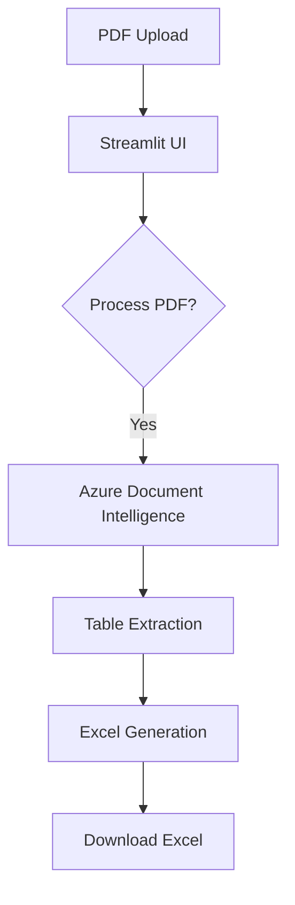
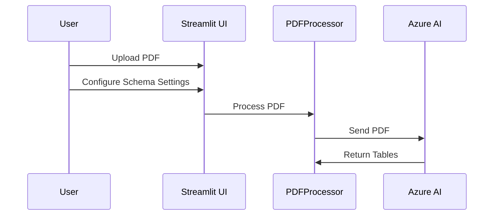

# PDFTablereader


A Python application that extracts tables from PDF files using Azure Document Intelligence (Form Recognizer) and generates structured schema files.

## Architecture Overview



## Module Description

### 1. PDF Extractor App (`src/pdfreader.py`)
Main application entry point with Streamlit UI components:
- Handles file upload
- Provides configuration interface
- Manages PDF processing workflow
- Displays results and downloads

### 2. PDF Processor (`src/pdf/pdf_processor.py`)
Core PDF processing module:
- Interfaces with Azure Document Intelligence
- Extracts tables from PDFs
- Generates Excel output

```

## Execution Flow

1. **PDF Upload and Configuration**


## Setup and Configuration

1. **Prerequisites**
   - Python >= 3.10
   - Docker (optional)
   - Azure Document Intelligence service

2. **Environment Setup**
   ```bash
   pip install -r requirements.txt
   ```

3. **Docker Build (Optional)**
   ```bash
   docker build -t pdf-extractor .
   docker run -p 8501:8501 pdf-extractor
   ```

## Usage

1. Start the application:
   ```bash
   streamlit run src/pdf_extractor_app_original_2.py
   ```

2. Upload PDF and Process:
   - Upload PDF file
   - Click "Process PDF"
   - Download Excel and/or YAML schema


## Error Handling

The application includes comprehensive error handling for:
- PDF processing errors
- File handling problems
- Azure API communication errors
